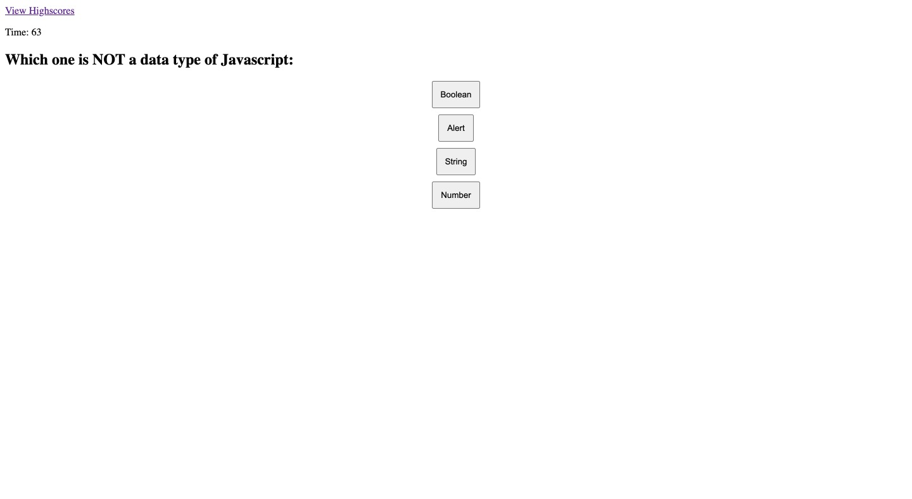

# code-quiz

## Introduction
This page is meant to be a quiz for javascript questions, after pressing the start button it will start the timer and show the first question.
Every question can be answered and there are 5 questions. If a wrong question is clicked 10 seconds are substracted from the timer.

The quiz ends when the 5 questoins have been solved or when the timer is up.

The score can then be saved on the local storage of the browser.

## Link to App
[Code Quiz](https://jpecheverryp.github.io/code-quiz/)

## Mock-Up

## How was it made?

This page uses mainly Javascript to generate content, only the main menu where you can read the instructions is created with html.
The content is generated dynamically using different functions that show/hide elements, and other functions that append/remove elements.